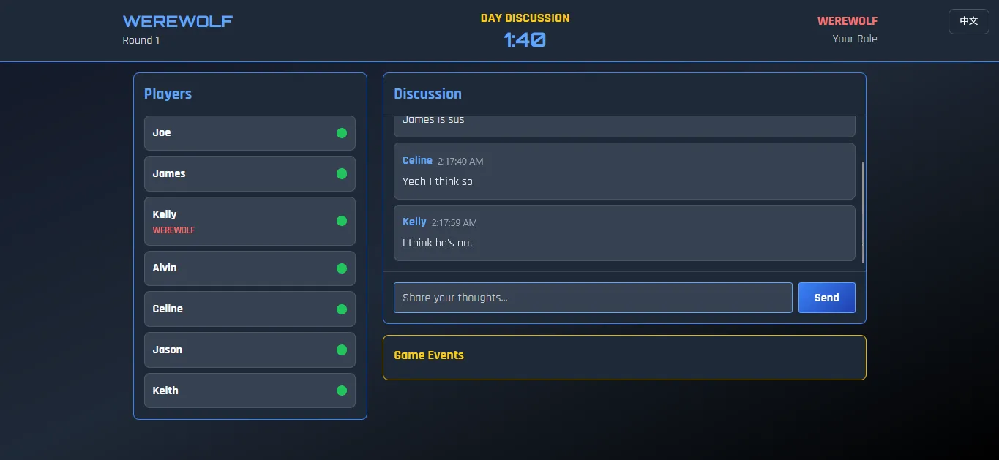
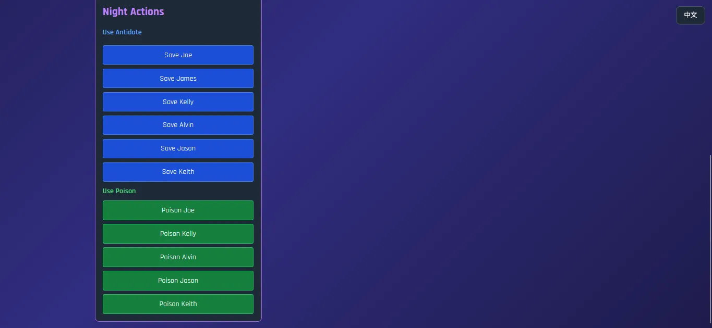

# Werewolf Game
A real-time multiplayer Werewolf game made using Socket.io

> [!NOTE]  
> The entire project must be self-hosted for now as I couldn't find anywhere to host an application that runs socket.io, most of them only provide free serverless hosting.

## About
- Two languages available (English, Chinese)
- Real-time multiplayer game
- Supports up to 8 players at once in a room, multiple rooms can be created
- Lightweight, runs on old devices to (no fancy animation yet amazing design)

## How to start ?
1. Git clone this repository
2. Install all the dependencies by running `npm install`
3. Run the application, which will host a server on port 3000 by default

## Demo

## License
This project is available as an open source under the terms of the [MIT License](/LICENSE)